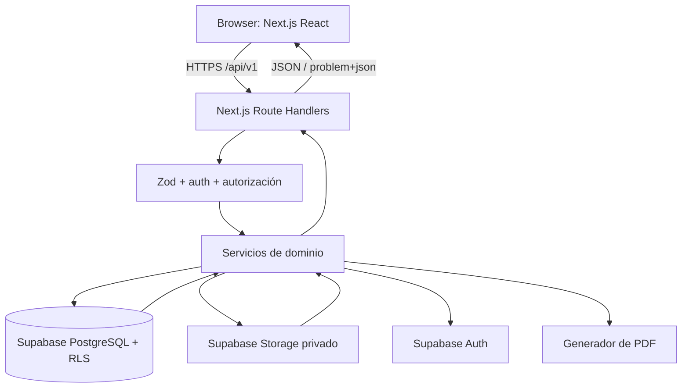
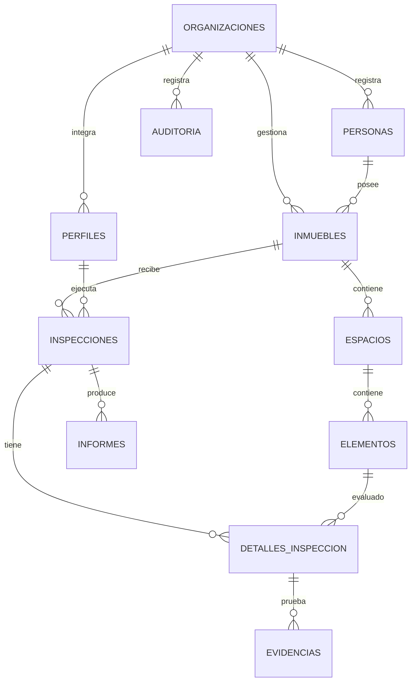
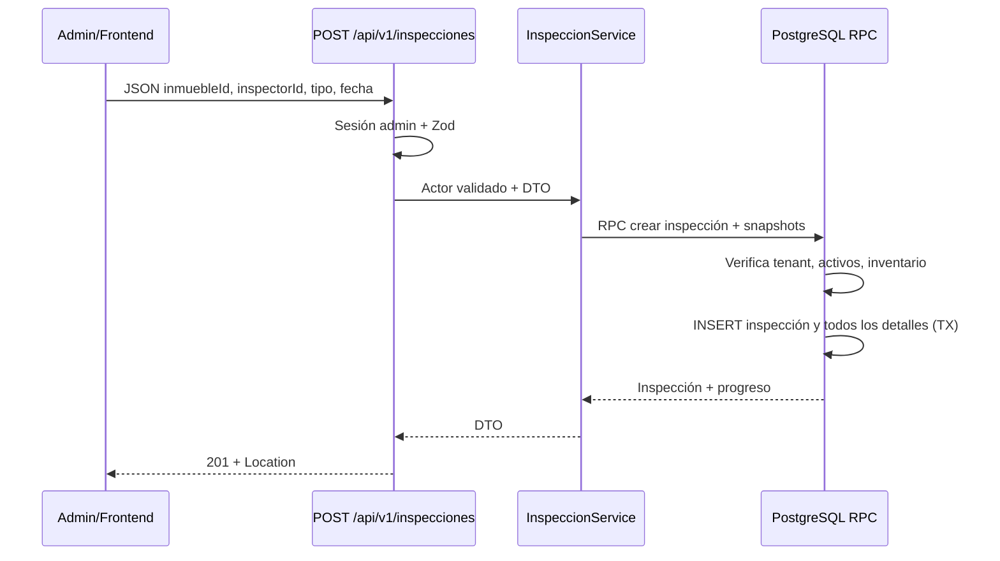
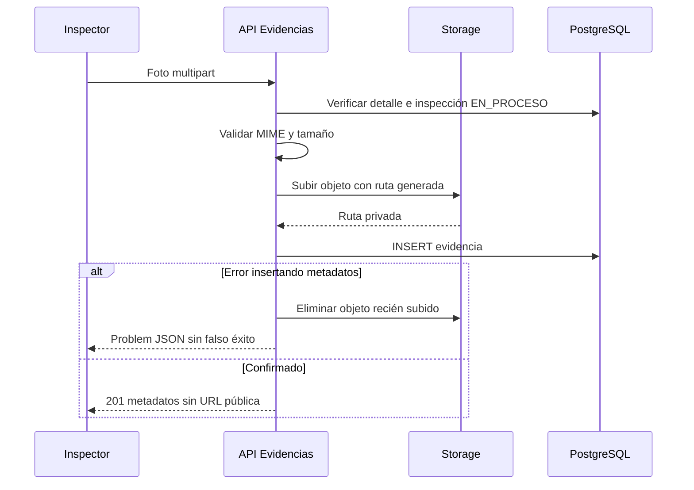
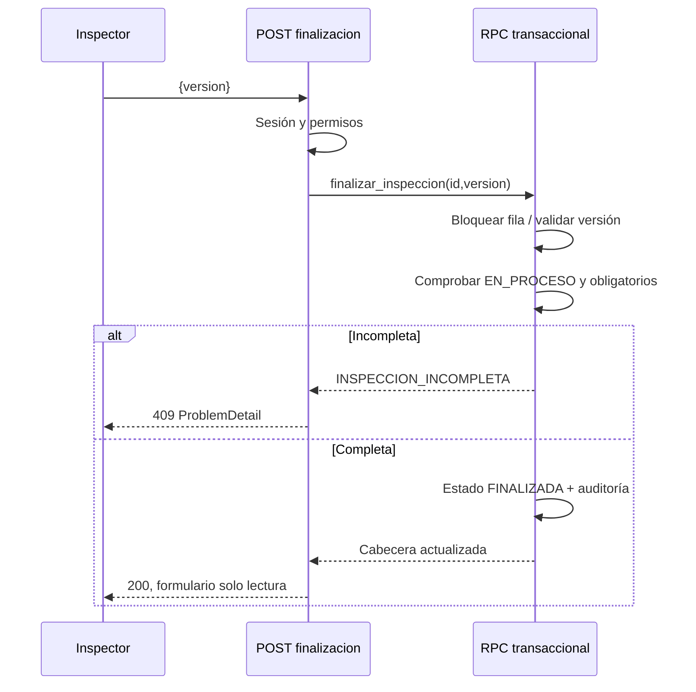

# InmoCheck — Diseño técnico de Backend, Frontend y API REST

**Proyecto:** Diplomado Full Stack · **Stack:** Next.js App Router, TypeScript, Supabase Auth, PostgreSQL, Supabase Storage, Tailwind CSS, Zod · **Base de API:** `/api/v1` · **Roles iniciales:** administrador e inspector.

> **Estado y trazabilidad:** este documento es una propuesta técnica derivada de la especificación funcional previa de InmoCheck y toma como **referencia de formato**, no de tecnología, el diseño adjunto de la API de préstamo de libros (objetivo, reglas, entidades, matriz de endpoints, contratos, errores, pruebas y definición de terminado). No supone que las rutas ya estén programadas. Se proponen valores, límites y nombres que deberán confirmarse al implementar.

## Índice

1. [Objetivo, límites y decisiones](#1-objetivo-límites-y-decisiones)
2. [Arquitectura de extremo a extremo](#2-arquitectura-de-extremo-a-extremo)
3. [Autenticación, autorización y matriz de permisos](#3-autenticación-autorización-y-matriz-de-permisos)
4. [Modelo de datos y decisiones de persistencia](#4-modelo-de-datos-y-decisiones-de-persistencia)
5. [Convenciones de API y contratos comunes](#5-convenciones-de-api-y-contratos-comunes)
6. [Matriz completa de endpoints](#6-matriz-completa-de-endpoints)
7. [Contratos JSON detallados y reglas por módulo](#7-contratos-json-detallados-y-reglas-por-módulo)
8. [Rutas y pantallas del frontend](#8-rutas-y-pantallas-del-frontend)
9. [Mapa frontend → API → Supabase](#9-mapa-frontend--api--supabase)
10. [Estructura de carpetas y responsabilidades](#10-estructura-de-carpetas-y-responsabilidades)
11. [Flujos de secuencia y transacciones críticas](#11-flujos-de-secuencia-y-transacciones-críticas)
12. [Seguridad, almacenamiento y privacidad](#12-seguridad-almacenamiento-y-privacidad)
13. [Pruebas, Postman y criterios de aceptación](#13-pruebas-postman-y-criterios-de-aceptación)
14. [Plan de implementación y definición de terminado](#14-plan-de-implementación-y-definición-de-terminado)
15. [Decisiones abiertas y ampliaciones](#15-decisiones-abiertas-y-ampliaciones)

---

# 1. Objetivo, límites y decisiones

## 1.1. Objetivo del documento

Definir **cómo construir** el MVP de InmoCheck, con especial énfasis en: rutas HTTP consumidas por el frontend; métodos y códigos de estado; parámetros y esquemas de petición/respuesta; rutas de navegación y permisos; modelo relacional; límites entre Next.js y Supabase; y pruebas reproducibles. La especificación funcional existente conserva la autoridad sobre **qué** hace el producto; este documento detalla **cómo se expone y consume**.

## 1.2. Módulos obligatorios del MVP

- Login, logout y recuperación de contraseña mediante Supabase Auth.
- Perfiles internos de **administrador** e **inspector**, sin registro público libre de personal.
- Propietarios como personas registradas, **sin cuentas de acceso**.
- Inmuebles, espacios y elementos inspeccionables.
- Programación, asignación, borradores, ejecución, cancelación y finalización de inspecciones.
- Evidencias fotográficas privadas por detalle de inspección.
- Historial, comparación entrada/salida, informe PDF, dashboard y auditoría mínima.

## 1.3. Exclusiones explícitas

No desarrollar en el MVP: contratos de arrendamiento, pagos, contabilidad, marketplace, portales de propietario/arrendatario, firma certificada, correos automáticos, modo offline completo, detección de daños por IA ni asignación automática de responsabilidad legal. **No exponer enlaces públicos permanentes** para fotografías ni permitir edición silenciosa de inspecciones cerradas.

## 1.4. Decisión principal: API BFF dentro de Next.js

El navegador consume los **Route Handlers** de Next.js en `/api/v1/*`. Esos handlers realizan autenticación/autorización, validación Zod, invocación de servicios, acceso a Supabase y serialización del contrato. Supabase proporciona Auth, PostgreSQL, RLS y Storage. El frontend **no** escribe directamente en tablas de negocio: así se concentra la lógica, se facilita Postman y se conserva un contrato versionable. La sesión se gestiona con el patrón SSR de Supabase en cookies seguras. No se implementa un servidor Express adicional.

Hay operaciones que **necesitan una transacción atómica** (finalizar y crear instantánea, reasignar, generar inventario inicial). Esas operaciones deben implementarse mediante funciones SQL/RPC transaccionales o mecanismos equivalentes en PostgreSQL; **no** mediante varias llamadas HTTP independientes desde el navegador. Las RLS siguen activas aunque exista una capa de API.

## 1.5. Contrato y convenciones de alcance

- Rutas de aplicación en español (`/dashboard/inmuebles`); endpoints REST también en español (`/api/v1/inmuebles`).
- JSON en `camelCase` para propiedades; tablas SQL en `snake_case`.
- IDs UUID; fechas UTC ISO 8601 (ej. `2026-09-26T15:00:00Z`); el frontend muestra zona `America/Bogota`.
- API documentada con OpenAPI 3.1 y colección Postman; los ejemplos son ilustrativos y contienen UUID ficticios.
- Paginación basada en `page`/`pageSize` para listados. Valores propuestos: `page=1`, `pageSize=20`, máximo 100.
- Campos extra no reconocidos se rechazan en escrituras; el servidor asigna IDs, marcas temporales, organización y autor.

---

# 2. Arquitectura de extremo a extremo



**Frontend:** páginas protegidas, tablas y formularios, validaciones de experiencia, estados de carga, errores y previsualización. **API:** identidad, políticas de permisos, validación y DTO, reglas de negocio, transacciones, auditoría, protección frente a peticiones maliciosas. **Supabase:** persistencia y límites definitivos de acceso mediante RLS y políticas de Storage. **PostgreSQL:** constraints, índices y operaciones atómicas.

No confiar en una condición `if (rol === 'admin')` dentro de un componente como mecanismo de seguridad: solo modifica la interfaz. La autorización real debe existir en servidor y datos.

## 2.1. Contrato entre capas

| Capa | Entrada | Salida | Nunca debe |
|---|---|---|---|
| Página Next.js | navegación, datos y acciones del usuario | vista y solicitudes HTTP | insertar en tablas ajenas ni asumir permisos por ocultar botones |
| Route Handler | método, sesión, params, JSON/form-data | JSON y estado HTTP | aceptar `organizacionId`, `autorId` o rol como autoridad del cliente |
| Servicio | actor validado + datos normalizados | entidad/resultado de negocio | mezclar componentes React con SQL |
| Repositorio/Supabase | consultas parametrizadas/RPC | filas autorizadas | utilizar clave `service_role` en el navegador |
| PostgreSQL/RLS | sesión, constraints, transacciones | persistencia consistente | permitir escrituras que vulneren tenant o cierre histórico |
| Storage | ruta de objeto + contexto de autorización | archivo o URL temporal | publicar fotos privadas sin autorización |

---

# 3. Autenticación, autorización y matriz de permisos

## 3.1. Identidad y sesión

`auth.users` pertenece a Supabase Auth. `public.perfiles` amplía el usuario con `nombre`, `rol`, `organizacion_id`, `activo`. No almacenar contraseñas ni tokens en `perfiles` o localStorage. Un usuario interno se **invita** mediante flujo administrativo en servidor. El administrador puede gestionar inspectores **de su organización**; el primer administrador/organización se aprovisiona mediante seed administrativo fuera de la API pública.

### Matriz

| Recurso/acción | Admin | Inspector asignado | Inspector no asignado | Propietario (MVP) |
|---|---|---|---|---|
| Dashboard global y métricas | Sí | No | No | Sin acceso |
| Listar inmuebles de su ámbito | Todos del tenant | Solo asociados a sus inspecciones | No | Sin acceso |
| Crear/editar/desactivar inmueble | Sí | No | No | No |
| Gestionar propietarios/inspectores | Sí | No | No | No |
| Crear/assignar/reasignar inspección | Sí | No | No | No |
| Leer inspección | Sí | Sí | No | No |
| Iniciar/guardar/finalizar inspección | No por defecto* | Sí | No | No |
| Cancelar pendiente/en proceso | Sí | No | No | No |
| Ver evidencias/informes | Todos del tenant | De su inspección | No | No |
| Leer auditoría | Sí | No | No | No |

`*` Para mantener la separación entre autoría y administración, un administrador no edita resultados de campo salvo que también esté designado formalmente inspector en una extensión futura.

## 3.2. Comprobaciones obligatorias

1. Obtener identidad **desde la sesión validada por Supabase**, no del JSON entrante.
2. Consultar `perfiles.activo` y `perfiles.organizacion_id`.
3. Validar el permiso por acción y la pertenencia del recurso a la organización.
4. Para operaciones de inspector, validar además `inspecciones.inspector_id = auth.uid()` y estado abierto.
5. Proteger la misma regla en RLS/RPC cuando proceda. No conceder al cliente permiso SQL que permita saltarse la API.
6. Los datos sensibles se filtran antes de responder (nunca exponer email/token/identificadores innecesarios).

## 3.3. Sesiones y endpoints de autenticación

Supabase Auth ejecuta el mecanismo real. La aplicación expone una **fachada HTTP** uniforme:

| Método | Ruta | Público | Propósito | Éxito |
|---|---|---:|---|---|
| `POST` | `/api/v1/auth/login` | Sí | Inicia sesión por email y contraseña; fija cookies | `200` |
| `POST` | `/api/v1/auth/logout` | Sesión | Cierra la sesión actual y borra cookies | `204` |
| `GET` | `/api/v1/auth/me` | Sesión | Perfil mínimo + capacidades de usuario actual | `200` |
| `POST` | `/api/v1/auth/recuperar-contrasena` | Sí | Solicita email de recuperación sin enumerar cuentas | `202` |

La página `/auth/actualizar-contrasena` gestiona el token de recuperación mediante el flujo oficial de Supabase SSR; no se incluye como operación administrativa. Los endpoints de login/recuperación requieren limitación de intentos, protección CSRF según el mecanismo de cookies y registro de eventos sin contraseñas.

---

# 4. Modelo de datos y decisiones de persistencia

## 4.1. Diagrama ER conceptual



## 4.2. Tablas y columnas principales

| Tabla | Campos representativos | Restricciones y justificación |
|---|---|---|
| `organizaciones` | `id`, `nombre`, `activo`, `created_at` | Raíz de aislamiento multi-inmobiliaria. |
| `perfiles` | `id` FK `auth.users`, `organizacion_id`, `nombre`, `rol`, `activo` | Rol `ADMIN` o `INSPECTOR`; índice por tenant y rol. |
| `personas` | `id`, `organizacion_id`, `nombre`, `email?`, `telefono?`, `tipo` | Propietario/arrendatario sin credenciales; retención de datos. |
| `inmuebles` | `id`, `organizacion_id`, `codigo`, `tipo`, `direccion`, `ciudad`, `departamento`, `propietario_id`, `activo`, `created_at`, `updated_at` | `UNIQUE(organizacion_id,codigo)`; `propietario_id` del mismo tenant. |
| `espacios` | `id`, `organizacion_id`, `inmueble_id`, `nombre`, `orden`, `activo` | No borrar si existen registros históricos. |
| `elementos` | `id`, `organizacion_id`, `espacio_id`, `nombre`, `obligatorio`, `activo`, `orden` | ID estable para comparar inspecciones. |
| `inspecciones` | `id`, `organizacion_id`, `inmueble_id`, `inspector_id`, `tipo`, `estado`, `programada_para`, `iniciada_en?`, `finalizada_en?`, `cancelada_en?`, `motivo_cancelacion?`, `version` | Estados y transiciones; `version` permite control optimista. |
| `detalles_inspeccion` | `id`, `organizacion_id`, `inspeccion_id`, `elemento_id`, `espacio_nombre_snapshot`, `elemento_nombre_snapshot`, `obligatorio_snapshot`, `estado?`, `observacion?`, `updated_at` | `UNIQUE(inspeccion_id,elemento_id)`; snapshot histórico. |
| `evidencias` | `id`, `organizacion_id`, `detalle_id`, `storage_path`, `mime_type`, `size_bytes`, `created_by`, `created_at` | `storage_path` único; asociación segura y política de retención. |
| `informes` | `id`, `organizacion_id`, `inspeccion_id`, `version`, `storage_path`, `sha256?`, `generado_en`, `generado_por` | `UNIQUE(inspeccion_id,version)`; PDF no mutable. |
| `auditoria` | `id`, `organizacion_id`, `actor_id`, `recurso`, `recurso_id`, `accion`, `antes?`, `despues?`, `fecha` | Solo inserciones desde funciones/servidor; no guardar secretos ni datos personales superfluos. |

**Relación de personas:** en MVP se requiere `propietario_id` en inmueble; la relación de arrendatario con una entrega puede representarse mediante tabla `ocupaciones` (`inmueble_id`, `arrendatario_id`, `desde`, `hasta`) únicamente si el equipo decide incluirla. No existe portal de acceso para estas personas.

## 4.3. Tipos y constraints sugeridos

```sql
create type perfil_rol as enum ('ADMIN','INSPECTOR');
create type inspeccion_tipo as enum ('ENTRADA','SALIDA','SEGUIMIENTO');
create type inspeccion_estado as enum ('PENDIENTE','EN_PROCESO','FINALIZADA','CANCELADA');
create type elemento_estado as enum ('EXCELENTE','BUENO','REGULAR','DANADO','NO_APLICA');

-- Ejemplo de invariantes (esquema completo en migraciones del proyecto)
alter table inmuebles add constraint uq_inmueble_codigo
  unique (organizacion_id, codigo);
alter table detalles_inspeccion add constraint uq_detalle_elemento
  unique (inspeccion_id, elemento_id);
create index idx_inspecciones_tenant_estado_fecha
  on inspecciones (organizacion_id, estado, programada_para desc);
create index idx_inspecciones_inspector_estado
  on inspecciones (inspector_id, estado, programada_para);
```

**No usar `ON DELETE CASCADE`** desde inmuebles/usuarios hacia inspecciones finalizadas. La exclusión de datos históricos, cuando proceda legalmente, tendrá un procedimiento separado y auditado. Comprobar que FKs relacionadas por `organizacion_id` no permitan referencias cruzadas entre tenants mediante FKs compuestas o restricciones transaccionales.

## 4.4. Snapshot inicial y comparación histórica

Al crear una inspección, almacenar los elementos vigentes como filas de `detalles_inspeccion`, con nombre de espacio y elemento y obligatoriedad capturados. Esto garantiza que añadir, renombrar o inactivar elementos después no altere la inspección ya creada. Para la comparación, relacionar `elemento_id` entre las dos inspecciones; elementos presentes solo en una se indican como `NO_COMPARABLE`, **no** como daño automático.

---

# 5. Convenciones de API y contratos comunes

## 5.1. Base, headers, versionado y transporte

**Origen de desarrollo:** `http://localhost:3000` · **Base:** `http://localhost:3000/api/v1` · **Producción:** mismo dominio HTTPS que el frontend. Sesión mediante cookies seguras httpOnly gestionadas por Supabase SSR; peticiones de mutación deben protegerse contra CSRF mediante `SameSite`, validación de `Origin` y protección adicional según el despliegue. API `application/json`, excepto `multipart/form-data` para fotografías y `application/pdf` para descargas. No entregar credenciales de Supabase service role al navegador.

Métodos: `GET` lectura; `POST` creación o acciones; `PATCH` actualización parcial; `DELETE` desactivación lógica o retirada de evidencias en borrador. No utilizar `GET` para cambiar estado. La finalización y cancelación son subrecursos/acciones `POST` para representar reglas complejas.

### Paginación, orden y filtros

`GET /api/v1/inmuebles?page=1&pageSize=20&search=pinos&activo=true&sort=-createdAt`

```json
{
  "data": [{"id":"11111111-1111-4111-8111-111111111111","codigo":"APT-302","direccion":"Calle 10 # 20-30"}],
  "meta": {"page":1,"pageSize":20,"total":37,"totalPages":2}
}
```

`page>=1`, `pageSize` de 1 a 100. `sort` limitado a columnas permitidas. Nunca interpolar directamente el `sort` del cliente en SQL. Las listas vacías devuelven `200` con `data:[]` y `total:0`, no `404`.

## 5.2. Formato común de error

Utilizar `application/problem+json` inspirado en **RFC 9457**. Ejemplo:

```json
{
  "type":"https://inmocheck.example/errors/inspection-incomplete",
  "title":"La inspección está incompleta",
  "status":409,
  "detail":"Hay 2 elementos obligatorios sin evaluar.",
  "instance":"/api/v1/inspecciones/44444444-4444-4444-8444-444444444444/finalizacion",
  "code":"INSPECCION_INCOMPLETA",
  "traceId":"req_01JABCXYZ",
  "errors":[{"field":"detalles[3].estado","message":"Campo obligatorio"}]
}
```

`errors` solo aparece en errores de validación; `traceId` ayuda al soporte y jamás expone SQL ni stack traces. Los mensajes en `detail` no deben revelar si existe un recurso de otra organización; para ese caso devolver `404` de manera consistente.

| HTTP | Cuándo | Ejemplo `code` |
|---|---|---|
| `400` | JSON/UUID/parámetro mal formado | `BAD_REQUEST` |
| `401` | Falta o expira la sesión | `UNAUTHENTICATED` |
| `403` | Actor identificado sin permiso general para la acción | `FORBIDDEN` |
| `404` | Recurso inexistente, no visible o ajeno al tenant | `NOT_FOUND` |
| `409` | Código duplicado, transición prohibida, conflicto de versión, inspección incompleta | `CONFLICT`, `INSPECCION_INCOMPLETA` |
| `413` | Archivo sobre límite | `FILE_TOO_LARGE` |
| `415` | Tipo de archivo no admitido | `UNSUPPORTED_MEDIA_TYPE` |
| `422` | Contenido JSON bien formado pero incumple el esquema de datos | `VALIDATION_ERROR` |
| `429` | Exceso de intentos, sobre todo Auth o subida | `RATE_LIMITED` |
| `500` | Error inesperado; respuesta genérica | `INTERNAL_ERROR` |
| `503` | Dependencia temporalmente no disponible | `DEPENDENCY_UNAVAILABLE` |

## 5.3. Respuestas y concurrencia

Creaciones: `201 Created`, cabecera `Location: /api/v1/recurso/{id}`. Actualizaciones: `200` y representación actualizada. Desactivación: `204` sin cuerpo. Para proteger borradores concurrentes, `PATCH` de detalle o inspección utiliza `version` esperado; si difiere, `409 VERSION_CONFLICT`. La función RPC incrementa la versión solo después de actualizar exitosamente. En endpoints críticos se recomienda aceptar `Idempotency-Key` y almacenar la clave de forma acotada por actor/operación para evitar duplicados tras reintentos de red.

---

# 6. Matriz completa de endpoints

`A` = admin; `I` = inspector asignado; `A/I` = ambos según ámbito. Todos requieren sesión **excepto** las operaciones señaladas como públicas. Los UUID de los paths deben validarse.

## 6.1. Identidad y personal

| Método | Endpoint | Actor | Solicitud | Éxito | Errores típicos |
|---|---|---|---|---|---|
| POST | `/api/v1/auth/login` | Público | `{email,password}` | 200 perfil/sesión en cookies | 400,401,429 |
| POST | `/api/v1/auth/logout` | A/I | — | 204 | 401 |
| GET | `/api/v1/auth/me` | A/I | — | 200 perfil actual | 401,403 |
| POST | `/api/v1/auth/recuperar-contrasena` | Público | `{email}` | 202 genérico | 400,429 |
| GET | `/api/v1/inspectores` | A | `?activo=&search=&page=` | 200 paginado | 401,403 |
| POST | `/api/v1/inspectores/invitaciones` | A | `{nombre,email}` | 201 invitación | 400,409,422 |
| PATCH | `/api/v1/inspectores/{id}` | A | `{nombre?,activo?}` | 200 perfil | 404,409 |

## 6.2. Propietarios e inmuebles

| Método | Endpoint | Actor | Solicitud | Éxito | Errores típicos |
|---|---|---|---|---|---|
| GET | `/api/v1/propietarios` | A | `?search=&page=` | 200 paginado | 401,403 |
| POST | `/api/v1/propietarios` | A | `PropietarioCreate` | 201 + Location | 422,409 |
| GET | `/api/v1/propietarios/{id}` | A | — | 200 | 404 |
| PATCH | `/api/v1/propietarios/{id}` | A | `PropietarioPatch` | 200 | 404,422 |
| GET | `/api/v1/inmuebles` | A/I* | filtros + paginación | 200 paginado | 401,403 |
| POST | `/api/v1/inmuebles` | A | `InmuebleCreate` | 201 + Location | 409,422 |
| GET | `/api/v1/inmuebles/{id}` | A/I* | — | 200 | 404 |
| PATCH | `/api/v1/inmuebles/{id}` | A | `InmueblePatch` | 200 | 404,409,422 |
| DELETE | `/api/v1/inmuebles/{id}` | A | — | 204 desactiva | 404,409 |
| GET | `/api/v1/inmuebles/{id}/historial` | A/I* | `?page=&tipo=` | 200 paginado | 404 |

`*` El inspector solo ve inmuebles vinculados a sus inspecciones asignadas; el administrador ve todos los de su organización. El `DELETE` no borra filas ni archivos históricos.

## 6.3. Inventario por inmueble

| Método | Endpoint | Actor | Solicitud | Éxito | Errores típicos |
|---|---|---|---|---|---|
| GET | `/api/v1/inmuebles/{id}/espacios` | A/I* | — | 200 lista con elementos | 404 |
| POST | `/api/v1/inmuebles/{id}/espacios` | A | `{nombre,orden?}` | 201 | 404,422 |
| PATCH | `/api/v1/espacios/{id}` | A | `{nombre?,orden?,activo?}` | 200 | 404,422 |
| POST | `/api/v1/espacios/{id}/elementos` | A | `{nombre,obligatorio,orden?}` | 201 | 404,422 |
| PATCH | `/api/v1/elementos/{id}` | A | `{nombre?,obligatorio?,activo?,orden?}` | 200 | 404,422 |

No se implementan borrados físicos de espacios/elementos con histórico. La inspección creada toma snapshots y no debe cambiar si el administrador modifica el inventario activo.

## 6.4. Inspecciones y detalles

| Método | Endpoint | Actor | Solicitud | Éxito | Errores típicos |
|---|---|---|---|---|---|
| GET | `/api/v1/inspecciones` | A/I | `?estado=&tipo=&inmuebleId=&desde=&hasta=&page=` | 200 paginado | 422 |
| POST | `/api/v1/inspecciones` | A | `{inmuebleId,inspectorId,tipo,programadaPara,nota?}` | 201 + Location | 404,409,422 |
| GET | `/api/v1/inspecciones/{id}` | A/I | — | 200 cabecera + progreso | 404 |
| PATCH | `/api/v1/inspecciones/{id}` | A | `{programadaPara?,nota?,version}` solo pendiente | 200 | 404,409 |
| POST | `/api/v1/inspecciones/{id}/reasignaciones` | A | `{inspectorId,motivo?,version}` | 200 | 404,409,422 |
| POST | `/api/v1/inspecciones/{id}/inicio` | I | `{version}` | 200 | 404,409 |
| GET | `/api/v1/inspecciones/{id}/detalles` | A/I | — | 200 lista | 404 |
| PATCH | `/api/v1/inspecciones/{id}/detalles/{detalleId}` | I | `{estado,observacion?,version}` | 200 | 404,409,422 |
| POST | `/api/v1/inspecciones/{id}/finalizacion` | I | `{version}` | 200 cerrada | 404,409 |
| POST | `/api/v1/inspecciones/{id}/cancelacion` | A | `{motivo,version}` | 200 cancelada | 404,409,422 |

`inicio` es idempotente solo mediante clave de idempotencia o si se define expresamente que repetirlo en `EN_PROCESO` devuelve el mismo estado. La opción propuesta es rechazar transición repetida con `409` sin clave; los reintentos del cliente deben consultar el estado actual.

## 6.5. Fotografías, informes, comparación, dashboard y auditoría

| Método | Endpoint | Actor | Solicitud | Éxito | Errores típicos |
|---|---|---|---|---|---|
| POST | `/api/v1/inspecciones/{id}/detalles/{detalleId}/evidencias` | I | `multipart/form-data` archivo | 201 metadatos | 404,409,413,415 |
| GET | `/api/v1/evidencias/{id}/acceso` | A/I autorizado | — | 200 URL firmada temporal | 404 |
| DELETE | `/api/v1/evidencias/{id}` | I | — solo borrador | 204 | 404,409 |
| GET | `/api/v1/inspecciones/{id}/comparacion?contra={entradaId}` | A/I autorizado | `contra` UUID | 200 diferencias | 404,409,422 |
| POST | `/api/v1/inspecciones/{id}/informes` | A/I autorizado | `{tipo:"ACTA"}` | 201 informe creado | 404,409,503 |
| GET | `/api/v1/inspecciones/{id}/informes` | A/I autorizado | — | 200 versiones | 404 |
| GET | `/api/v1/informes/{id}/descarga` | A/I autorizado | — | 302 URL temporal o 200 PDF | 404,503 |
| GET | `/api/v1/dashboard/resumen` | A | `?desde=&hasta=` | 200 indicadores | 401,403,422 |
| GET | `/api/v1/auditoria` | A | `?recurso=&recursoId=&desde=&hasta=&page=` | 200 paginado | 401,403,422 |

**Total propuesto: 41 endpoints** en el MVP ampliado. El equipo puede entregar por fases: primero Auth + inmuebles + inspecciones + detalles; posteriormente inventario, fotos, comparación e informes. La matriz completa representa el **contrato objetivo** y no exige implementarlos todos en una única semana.

---

# 7. Contratos JSON detallados y reglas por módulo

Los ejemplos muestran la forma y las claves relevantes. **No** deben interpretarse como un esquema completo de validación sin las restricciones de cada sección. Los IDs se muestran con valores ficticios coherentes.

## 7.1. Auth

### `POST /api/v1/auth/login`

```json
{"email":"inspector@ejemplo.com","password":"********"}
```

**200 OK** (cookies seguras; nunca devolver refresh token en el JSON):

```json
{"data":{"id":"aaaaaaaa-aaaa-4aaa-8aaa-aaaaaaaaaaaa","nombre":"Laura Díaz","rol":"INSPECTOR","activo":true,"organizacion":{"id":"bbbbbbbb-bbbb-4bbb-8bbb-bbbbbbbbbbbb","nombre":"Inmobiliaria Ejemplo"}}}
```

Errores: `400` formato inválido; `401` credenciales incorrectas con mensaje genérico; `403` cuenta desactivada; `429` límite de intentos. `GET /auth/me` devuelve la misma estructura de `data`, sin contraseñas.

### `POST /api/v1/auth/recuperar-contrasena`

```json
{"email":"persona@ejemplo.com"}
```

**202 Accepted** con mensaje uniforme: `{"message":"Si la cuenta existe, enviaremos instrucciones de recuperación."}`. **Nunca** confirmar públicamente qué cuentas existen.

## 7.2. Propietarios

### `POST /api/v1/propietarios`

```json
{"nombre":"María López","email":"maria@example.com","telefono":"+57 300 000 0000"}
```

**201 Created:**

```json
{"data":{"id":"cccccccc-cccc-4ccc-8ccc-cccccccccccc","nombre":"María López","email":"maria@example.com","telefono":"+57 300 000 0000","tipo":"PROPIETARIO","createdAt":"2026-09-26T15:00:00Z"}}
```

Validar nombre de 2–120 caracteres; email opcional válido y normalizado; teléfono opcional con límite razonable. **No** introducir contraseñas ni crear automáticamente una cuenta Auth para el propietario. `PATCH` acepta solo los campos permitidos; no cambia el tenant.

## 7.3. Inmuebles

### `POST /api/v1/inmuebles`

```json
{
  "codigo":"APT-302",
  "tipo":"APARTAMENTO",
  "direccion":"Calle 10 #20-30, apartamento 302",
  "barrio":"Centro",
  "ciudad":"Villavicencio",
  "departamento":"Meta",
  "habitaciones":3,
  "banos":2,
  "areaM2":85.5,
  "propietarioId":"cccccccc-cccc-4ccc-8ccc-cccccccccccc",
  "descripcion":"Apartamento residencial"
}
```

**201 Created**, `Location: /api/v1/inmuebles/11111111-1111-4111-8111-111111111111`:

```json
{"data":{"id":"11111111-1111-4111-8111-111111111111","codigo":"APT-302","tipo":"APARTAMENTO","direccion":"Calle 10 #20-30, apartamento 302","ciudad":"Villavicencio","departamento":"Meta","activo":true,"propietario":{"id":"cccccccc-cccc-4ccc-8ccc-cccccccccccc","nombre":"María López"},"createdAt":"2026-09-26T15:00:00Z"}}
```

Reglas: `codigo` obligatorio y único **por organización**, `habitaciones`/`banos` enteros >=0, `areaM2` >0 si aparece. `propietarioId` debe pertenecer al mismo tenant. Si ya existe el código: `409 CODIGO_INMUEBLE_DUPLICADO`. `PATCH` permite descripción/dirección y demás campos editables, pero **no** `id`, `organizacionId`, `createdAt` ni historial. `DELETE` desactiva (`activo=false`) y rechaza si alguna operación activa requiere explícitamente un inmueble activo según la regla acordada (propuesta: permitir desactivar únicamente cuando no haya inspecciones pendientes/en proceso).

### `GET /api/v1/inmuebles`

Filtros: `search` (coincidencia parcial en código/dirección/ciudad), `activo`, `tipo`, `page`, `pageSize`, `sort`; combinables. El inspector recibe solo inmuebles asociados a sus asignaciones, incluso si conoce otro UUID.

## 7.4. Inventario: espacios y elementos

### `POST /api/v1/inmuebles/{id}/espacios`

```json
{"nombre":"Cocina","orden":1}
```

**201:** `{"data":{"id":"22222222-2222-4222-8222-222222222222","inmuebleId":"11111111-1111-4111-8111-111111111111","nombre":"Cocina","orden":1,"activo":true}}`

### `POST /api/v1/espacios/{id}/elementos`

```json
{"nombre":"Grifería","obligatorio":true,"orden":2}
```

**201:** `{"data":{"id":"33333333-3333-4333-8333-333333333333","espacioId":"22222222-2222-4222-8222-222222222222","nombre":"Grifería","obligatorio":true,"orden":2,"activo":true}}`

`GET /inmuebles/{id}/espacios` devuelve jerarquía: `[{id,nombre,orden,elementos:[{id,nombre,obligatorio,orden}]}]`. `PATCH` modifica únicamente inventario futuro: no debe reescribir snapshots existentes. Si un elemento ya tiene historial, `activo=false` sustituye cualquier borrado.

## 7.5. Inspecciones: creación, asignación e inicio

### `POST /api/v1/inspecciones`

```json
{
  "inmuebleId":"11111111-1111-4111-8111-111111111111",
  "inspectorId":"aaaaaaaa-aaaa-4aaa-8aaa-aaaaaaaaaaaa",
  "tipo":"ENTRADA",
  "programadaPara":"2026-09-28T14:00:00Z",
  "nota":"Revisar especialmente la cocina"
}
```

**201 Created:**

```json
{"data":{"id":"44444444-4444-4444-8444-444444444444","inmuebleId":"11111111-1111-4111-8111-111111111111","inspectorId":"aaaaaaaa-aaaa-4aaa-8aaa-aaaaaaaaaaaa","tipo":"ENTRADA","estado":"PENDIENTE","programadaPara":"2026-09-28T14:00:00Z","progreso":{"evaluados":0,"total":15,"obligatoriosPendientes":12},"version":1}}
```

La creación debe verificar inmueble activo, inspector activo y ambos del mismo tenant; crear detalles de inspección a partir del inventario actual **en la misma transacción**. Rechazar inventario vacío (`409 INVENTARIO_VACIO`). Las fechas se normalizan a UTC.

### `POST /api/v1/inspecciones/{id}/inicio`

```json
{"version":1}
```

**200:** `{"data":{"id":"44444444-4444-4444-8444-444444444444","estado":"EN_PROCESO","iniciadaEn":"2026-09-28T14:03:00Z","version":2}}`. Solo el inspector asignado puede ejecutarlo; transición válida exclusivamente `PENDIENTE` → `EN_PROCESO`.

### `POST /api/v1/inspecciones/{id}/reasignaciones`

```json
{"inspectorId":"dddddddd-dddd-4ddd-8ddd-dddddddddddd","motivo":"Inspector original incapacitado","version":2}
```

**200** inspector actualizado + `version` siguiente y auditoría. Si estaba `EN_PROCESO`, `motivo` no puede quedar vacío. Si `FINALIZADA` o `CANCELADA`, `409 INSPECCION_CERRADA`.

## 7.6. Detalles y guardado incremental

### `GET /api/v1/inspecciones/{id}/detalles`

```json
{"data":[{"id":"55555555-5555-4555-8555-555555555555","elementoId":"33333333-3333-4333-8333-333333333333","espacioNombre":"Cocina","elementoNombre":"Grifería","obligatorio":true,"estado":null,"observacion":null,"evidencias":[],"version":1}],"meta":{"total":15,"evaluados":0,"obligatoriosPendientes":12}}
```

### `PATCH /api/v1/inspecciones/{id}/detalles/{detalleId}`

```json
{"estado":"REGULAR","observacion":"La llave presenta fuga leve.","version":1}
```

**200:**

```json
{"data":{"id":"55555555-5555-4555-8555-555555555555","estado":"REGULAR","observacion":"La llave presenta fuga leve.","version":2,"updatedAt":"2026-09-28T14:18:00Z"}}
```

Estados exactos: `EXCELENTE`, `BUENO`, `REGULAR`, `DANADO`, `NO_APLICA`. Al seleccionar `NO_APLICA` para un elemento obligatorio, exigir observación no vacía. Limitar observación, por ejemplo 2000 caracteres. Rechazar detalle de otra inspección aunque el usuario tenga acceso a ambas; validar relación `detalle.inspeccion_id=id`. Solo modificar si la inspección está `EN_PROCESO` y pertenece al inspector. Si el `version` no coincide, `409 VERSION_CONFLICT`, devolver estado actualizado mediante `GET` antes de reintentar.

### `POST /api/v1/inspecciones/{id}/finalizacion`

```json
{"version":7}
```

**200:** `{"data":{"id":"44444444-4444-4444-8444-444444444444","estado":"FINALIZADA","finalizadaEn":"2026-09-28T16:30:00Z","version":8}}`. Validación transaccional: todos los detalles obligatorios evaluados o `NO_APLICA` justificado; sin cargas de fotografía pendientes; autor válido; versión esperada; estado `EN_PROCESO`. No implica que se haya generado el PDF; ese es un proceso independiente y reintentable.

### `POST /api/v1/inspecciones/{id}/cancelacion`

```json
{"motivo":"El ocupante canceló la visita","version":1}
```

**200:** `{"data":{"id":"44444444-4444-4444-8444-444444444444","estado":"CANCELADA","canceladaEn":"2026-09-27T12:00:00Z","version":2}}`. Sólo admin; `motivo` obligatorio; se conserva historial y se prohíbe cancelar una finalizada.

## 7.7. Evidencias (fotos)

### `POST /api/v1/inspecciones/{id}/detalles/{detalleId}/evidencias`

**Request:** `multipart/form-data` con campo `archivo` y opcional `descripcion`. Propuesta MVP: máximo **10 MB por fotografía**, hasta **8 fotos por detalle**, MIME `image/jpeg`, `image/png`, `image/webp`; valores configurables. El servidor valida archivo **real**, tamaño, usuario, tenant, relación del detalle y estado antes de subir. Recomendada ruta privada: `org/{organizacionId}/inspecciones/{inspeccionId}/detalles/{detalleId}/{uuid}.webp` (nombre generado, nunca nombre proporcionado como ruta).

**201 Created:**

```json
{"data":{"id":"66666666-6666-4666-8666-666666666666","detalleId":"55555555-5555-4555-8555-555555555555","mimeType":"image/webp","sizeBytes":503221,"descripcion":"Fuga en llave","createdAt":"2026-09-28T14:23:00Z"}}
```

**No devolver `storagePath` público ni URL permanente.** El servidor debe evitar huérfanos: si falla insertar metadatos tras subida, eliminar el objeto (compensación) o dejarlo en área temporal con tarea de limpieza. Un `DELETE /evidencias/{id}` solo se acepta mientras la inspección esté abierta, para su inspector. Usar almacenamiento privado y políticas de acceso coherentes con el tenant.

### `GET /api/v1/evidencias/{id}/acceso`

**200** `{"data":{"url":"<URL_FIRMADA_TEMPORAL>","expiresIn":60}}`. El token firmado solo se emite tras autorización. **Alternativa:** streaming binario a través de la API. Nunca almacenar la URL temporal como dato de negocio.

## 7.8. Comparación

### `GET /api/v1/inspecciones/{id}/comparacion?contra={entradaId}`

Requisitos: ambas inspecciones `FINALIZADA`, mismo inmueble y tenant, la inspección `contra` debe ser `ENTRADA` anterior y la de `id` `SALIDA`. La comparación usa identificadores estables y snapshots; muestra diferencias sin adjudicar culpa.

**200:**

```json
{
 "data":{
  "entradaId":"77777777-7777-4777-8777-777777777777",
  "salidaId":"88888888-8888-4888-8888-888888888888",
  "resumen":{"elementosComparados":14,"cambios":2,"noComparables":1},
  "elementos":[
   {"elementoId":"33333333-3333-4333-8333-333333333333","espacio":"Cocina","nombre":"Grifería","entrada":{"estado":"BUENO","observacion":null,"evidenciaIds":[]},"salida":{"estado":"REGULAR","observacion":"Presenta fuga","evidenciaIds":["66666666-6666-4666-8666-666666666666"]},"resultado":"CAMBIO"},
   {"elementoId":null,"espacio":"Baño","nombre":"Accesorio añadido","entrada":null,"salida":{"estado":"BUENO","observacion":null,"evidenciaIds":[]},"resultado":"NO_COMPARABLE"}
  ]
 }
}
```

`resultado` es `SIN_CAMBIO | CAMBIO | NO_COMPARABLE` según igualdad de **estado registrado**, sin intentar cuantificar deterioro, desgaste normal ni responsabilidad.

## 7.9. Informes

### `POST /api/v1/inspecciones/{id}/informes`

```json
{"tipo":"ACTA"}
```

**201:** `{"data":{"id":"99999999-9999-4999-8999-999999999999","inspeccionId":"44444444-4444-4444-8444-444444444444","version":1,"estado":"DISPONIBLE","generadoEn":"2026-09-28T16:32:00Z"}}` + `Location`. **Precondición:** inspección `FINALIZADA`. La API compone el documento usando snapshots, lo guarda en bucket privado y crea registro `informes`. Si falla el PDF, la inspección **permanece finalizada**; el error no cambia el estado del recurso principal. Evitar duplicados generando idempotencia por `inspeccion_id + versión de informe + tipo` o clave de operación.

`GET /api/v1/inspecciones/{id}/informes` lista `id`, `version`, `generadoEn`, `estado`. `GET /api/v1/informes/{id}/descarga` valida autorización y responde **302** a URL firmada de muy corta duración o **200** con `Content-Type: application/pdf` y `Content-Disposition: attachment`; elegir uno y probarlo. La propuesta por defecto es **302** firmada, siempre bajo HTTPS.

## 7.10. Dashboard y auditoría

`GET /api/v1/dashboard/resumen?desde=2026-09-01&hasta=2026-09-30`:

```json
{"data":{"inmueblesActivos":150,"inspectoresActivos":8,"inspecciones":{"pendientes":13,"enProceso":4,"finalizadas":27,"canceladas":2},"proximas":[{"id":"44444444-4444-4444-8444-444444444444","codigoInmueble":"APT-302","programadaPara":"2026-09-28T14:00:00Z"}]}}
```

Los filtros de fecha aplican a inspecciones según `programada_para` (definir explícitamente otro criterio si se necesita). Los contadores de inmuebles/inspectores son actuales, no históricos; explicarlo en el UI. Recurso sólo admin. Consultas SQL de agregación deben filtrar tenant antes de agrupar.

`GET /api/v1/auditoria?recurso=INSPECCION&recursoId=...&page=1` entrega eventos autorizados del tenant, paginados y con información personal mínima:

```json
{"data":[{"id":"eeeeeeee-eeee-4eee-8eee-eeeeeeeeeeee","actor":{"id":"aaaaaaaa-aaaa-4aaa-8aaa-aaaaaaaaaaaa","nombre":"Laura Díaz"},"recurso":"INSPECCION","recursoId":"44444444-4444-4444-8444-444444444444","accion":"FINALIZADA","fecha":"2026-09-28T16:30:00Z"}],"meta":{"page":1,"pageSize":20,"total":1,"totalPages":1}}
```

---

# 8. Rutas y pantallas del frontend

## 8.1. Convención de rutas App Router

Usar grupos de rutas `(public)` y `(protected)` en `src/app`: los nombres entre paréntesis organizan el código y **no aparecen en la URL**. Las rutas con `[id]` corresponden a parámetros dinámicos. **La navegación no concede permisos**: validar en layout/servidor y en los propios endpoints.

| URL navegable | Pantalla | Rol | Datos y acciones | API principal |
|---|---|---|---|---|
| `/login` | Formulario de ingreso | Público | login | `POST /auth/login` |
| `/recuperar-contrasena` | Solicitar enlace | Público | recuperación | `POST /auth/recuperar-contrasena` |
| `/auth/actualizar-contrasena` | Establecer nueva clave | Enlace verificado | Supabase Auth recovery | flujo SSR Auth |
| `/dashboard` | Inicio | A | indicadores y próximas inspecciones | `GET /dashboard/resumen` |
| `/dashboard/mis-inspecciones` | Agenda del inspector | I | filtros, comenzar, continuar | `GET /inspecciones`, `POST /inicio` |
| `/dashboard/inmuebles` | Catálogo | A/I según ámbito | buscar/filtrar/paginar | `GET /inmuebles` |
| `/dashboard/inmuebles/nuevo` | Formulario alta | A | guardar inmueble | `POST /inmuebles` |
| `/dashboard/inmuebles/[id]` | Ficha de propiedad | A/I | ver ficha, inventario, historial | `GET /inmuebles/{id}` |
| `/dashboard/inmuebles/[id]/editar` | Editar | A | actualizar, desactivar | `PATCH/DELETE /inmuebles/{id}` |
| `/dashboard/inmuebles/[id]/inventario` | Espacios y elementos | A/I lectura, A escritura | alta/edición inventario | `/espacios`, `/elementos` |
| `/dashboard/inmuebles/[id]/historial` | Inspecciones previas | A/I | listado y filtros | `GET /inmuebles/{id}/historial` |
| `/dashboard/propietarios` | Personas propietarias | A | lista/alta | `GET/POST /propietarios` |
| `/dashboard/propietarios/[id]` | Detalle/edición | A | ver/editar | `GET/PATCH /propietarios/{id}` |
| `/dashboard/inspectores` | Gestión de personal | A | lista/activar/invitar | `GET /inspectores`, `POST /invitaciones` |
| `/dashboard/inspectores/[id]` | Perfil del inspector | A | actualizar/activar | `PATCH /inspectores/{id}` |
| `/dashboard/inspecciones` | Catálogo de inspecciones | A/I | filtrar/abrir | `GET /inspecciones` |
| `/dashboard/inspecciones/nueva` | Programación | A | crear/asignar | `POST /inspecciones` |
| `/dashboard/inspecciones/[id]` | Detalle y acciones | A/I | ver, iniciar, cancelar, informes | `GET /inspecciones/{id}` |
| `/dashboard/inspecciones/[id]/realizar` | Formulario móvil | I asignado | evaluaciones, fotos, borrador, cierre | `GET/PATCH /detalles`, fotos, finalización |
| `/dashboard/inspecciones/[id]/comparar` | Entrada vs salida | A/I autorizado | elegir entrada, ver diferencias | `GET /comparacion` |
| `/dashboard/inspecciones/[id]/informe` | Vista informe | A/I autorizado | generar/descargar PDF | `POST/GET /informes` |
| `/dashboard/auditoria` | Historial operacional | A | filtros | `GET /auditoria` |
| `/403` | Sin permiso | Sesión | mensaje sin datos sensibles | — |
| `/404` | No encontrado/no visible | General | mensaje uniforme | — |

En rol `INSPECTOR`, `/dashboard` puede redirigir **sin mostrar el dashboard administrativo** a `/dashboard/mis-inspecciones`.

## 8.2. Detalles de UX por pantalla principal

**Catálogo de inmuebles:** búsqueda con debounce, filtros por tipo/activo y paginación server-side; tabla en desktop y tarjetas en móvil. Columna de acciones según rol. Vacío: mostrar CTA de crear únicamente a admin. Errores: conservar filtros y mostrar botón reintentar.

**Nuevo inmueble:** campos generales, selector de propietario existente y enlace para crearlo. Validación anticipada Zod, errores por campo, estado `submitting` que evita envíos dobles; navegar a ficha solo tras recibir `201`.

**Inventario:** árbol de espacios y elementos, orden editable y campo obligatorio. Al desactivar, mostrar aviso de que inspecciones anteriores mantienen snapshot. No permitir editar inventario desde la pantalla de evaluación del inspector.

**Agenda del inspector:** inspecciones asignadas agrupadas por estado/fecha, prioridad de tareas próximas; no mostrar tareas de compañeros. Inicio explícito vía `POST /inicio` y no por abrir la ficha.

**Realizar inspección:** diseño **mobile-first**, navegación por espacios, progreso `evaluados/total`, select de estado, observaciones, cargador de fotografías y botón Guardar por elemento. Evitar marcar guardado hasta confirmación HTTP. Ante `409 VERSION_CONFLICT`, recuperar versión actual y permitir comparar antes de sobrescribir; no hacer reintentos ciegos.

**Comparación:** dos columnas visuales entrada/salida, filtros `cambios`/`todos`/`no comparables`, evidencias bajo acceso temporal; etiqueta «Cambio de estado registrado» y aviso de que no determina responsabilidades.

**Informe:** resumen de la inspección cerrada, estado de generación y descarga. Si la generación falla, mostrar reintento sin reabrir inspección.

## 8.3. Estados de la UI

Cada vista que consume API debe representar cuatro estados: `loading`, `success`, `empty` y `error`. Formularios además muestran `dirty`, `submitting` y `saved`; carga de fotos muestra `uploading` y errores por archivo. En operaciones críticas solicitar confirmación y mostrar el estado devuelto por el backend. Nunca simular persistencia con solo cambiar React state.

---

# 9. Mapa frontend → API → Supabase

| Evento del usuario | Componente/pantalla | HTTP | Operación persistente | Resultado de UI |
|---|---|---|---|---|
| Inicia sesión | `/login` | `POST /auth/login` | Supabase Auth + `perfiles` | redirect por rol |
| Abre catálogo | `/dashboard/inmuebles` | `GET /inmuebles` | SELECT tenant/RLS | tabla paginada |
| Registra inmueble | `/inmuebles/nuevo` | `POST /inmuebles` | INSERT + UNIQUE | ficha del nuevo inmueble |
| Agrega grifería | `/inventario` | `POST /espacios/{id}/elementos` | INSERT elemento | aparece en árbol |
| Agenda visita | `/inspecciones/nueva` | `POST /inspecciones` | RPC crea inspección + snapshots | visita pendiente |
| Empieza visita | `/mis-inspecciones` | `POST /inspecciones/{id}/inicio` | RPC transición + auditoría | formulario habilitado |
| Evalúa grifería | `/realizar` | `PATCH /detalles/{id}` | UPDATE con versión + auditoría según política | muestra guardado confirmado |
| Sube foto | `/realizar` | `POST /evidencias` | Storage privado + INSERT metadata | miniatura privada |
| Finaliza visita | `/realizar` | `POST /finalizacion` | RPC valida y cierra atómicamente | formulario solo lectura |
| Compara revisiones | `/comparar` | `GET /comparacion` | SELECT snapshots | tabla con cambios |
| Genera acta | `/informe` | `POST /informes` | PDF + Storage + INSERT | opción descargar |
| Descarga acta | `/informe` | `GET /informes/{id}/descarga` | autorización + signed URL | PDF |

## 9.1. Ejemplo de cliente tipado

```ts
// src/lib/api/client.ts — ejemplo orientativo
export class ApiError extends Error {
  constructor(public status: number, public code: string, message: string) {
    super(message);
  }
}

export async function apiFetch<T>(path: string, init: RequestInit = {}): Promise<T> {
  const response = await fetch(`/api/v1${path}`, {
    ...init,
    credentials: 'same-origin',
    headers: { 'Content-Type': 'application/json', ...init.headers },
  });
  if (!response.ok) {
    const problem = await response.json().catch(() => ({}));
    throw new ApiError(response.status, problem.code ?? 'HTTP_ERROR', problem.detail ?? 'Solicitud fallida');
  }
  if (response.status === 204) return undefined as T;
  return response.json() as Promise<T>;
}

// Ejemplo de consumo desde un componente cliente:
// const respuesta = await apiFetch<{data: Inspeccion}>(`/inspecciones/${id}`);
```

**Excepción importante:** no usar este wrapper JSON para cargas `multipart/form-data` ni para archivos PDF; `fetch` debe enviar `FormData` sin establecer manualmente `Content-Type` y debe gestionar binarios/redirect según el contrato. Para datos iniciales, un Server Component puede llamar **directamente al servicio de servidor** en lugar de realizar un HTTP interno contra el propio deployment; el contrato `/api/v1` sigue siendo el consumido desde componentes cliente y Postman.

## 9.2. Ejemplo Route Handler + validación

```ts
// src/app/api/v1/inmuebles/route.ts (fragmento orientativo)
import { NextResponse } from 'next/server';
import { z } from 'zod';
import { requireRole } from '@/server/auth/require-role';
import { crearInmueble } from '@/server/services/inmuebles.service';
import { toProblem } from '@/server/http/problem';

const Create = z.object({
  codigo: z.string().trim().min(2).max(40),
  tipo: z.enum(['CASA', 'APARTAMENTO', 'OTRO']),
  direccion: z.string().trim().min(5).max(240),
  ciudad: z.string().trim().min(2),
  departamento: z.string().trim().min(2),
  propietarioId: z.string().uuid(),
  habitaciones: z.number().int().min(0),
  banos: z.number().int().min(0),
  areaM2: z.number().positive().optional(),
  barrio: z.string().optional(),
  descripcion: z.string().optional(),
}).strict();

export async function POST(request: Request) {
  try {
    const actor = await requireRole('ADMIN');
    const input = Create.parse(await request.json());
    const result = await crearInmueble({ actor, input });
    return NextResponse.json({ data: result }, {
      status: 201,
      headers: { Location: `/api/v1/inmuebles/${result.id}` }
    });
  } catch (error) {
    return toProblem(error, request.url); // convierte Zod/negocio en RFC 9457
  }
}
```

El ejemplo requiere implementar `requireRole`, `crearInmueble` y `toProblem`; **no es un archivo ejecutable autónomo**. `organizacion_id` se obtiene de `actor`, nunca del body. La autorización también debe quedar reflejada en RLS o RPC.

---

# 10. Estructura de carpetas y responsabilidades

```text
inmocheck/
├── src/
│   ├── app/
│   │   ├── (public)/
│   │   │   ├── login/page.tsx
│   │   │   └── recuperar-contrasena/page.tsx
│   │   ├── auth/actualizar-contrasena/page.tsx
│   │   ├── (protected)/dashboard/
│   │   │   ├── layout.tsx
│   │   │   ├── page.tsx
│   │   │   ├── mis-inspecciones/page.tsx
│   │   │   ├── inmuebles/
│   │   │   │   ├── page.tsx
│   │   │   │   ├── nuevo/page.tsx
│   │   │   │   └── [id]/
│   │   │   │       ├── page.tsx
│   │   │   │       ├── editar/page.tsx
│   │   │   │       ├── inventario/page.tsx
│   │   │   │       └── historial/page.tsx
│   │   │   ├── propietarios/[id]/page.tsx
│   │   │   ├── propietarios/page.tsx
│   │   │   ├── inspectores/[id]/page.tsx
│   │   │   ├── inspectores/page.tsx
│   │   │   ├── inspecciones/
│   │   │   │   ├── page.tsx
│   │   │   │   ├── nueva/page.tsx
│   │   │   │   └── [id]/
│   │   │   │       ├── page.tsx
│   │   │   │       ├── realizar/page.tsx
│   │   │   │       ├── comparar/page.tsx
│   │   │   │       └── informe/page.tsx
│   │   │   └── auditoria/page.tsx
│   │   ├── api/v1/
│   │   │   ├── auth/{login,logout,me,recuperar-contrasena}/route.ts
│   │   │   ├── propietarios/route.ts
│   │   │   ├── propietarios/[id]/route.ts
│   │   │   ├── inspectores/route.ts
│   │   │   ├── inspectores/invitaciones/route.ts
│   │   │   ├── inspectores/[id]/route.ts
│   │   │   ├── inmuebles/route.ts
│   │   │   ├── inmuebles/[id]/route.ts
│   │   │   ├── inmuebles/[id]/espacios/route.ts
│   │   │   ├── inmuebles/[id]/historial/route.ts
│   │   │   ├── espacios/[id]/route.ts
│   │   │   ├── espacios/[id]/elementos/route.ts
│   │   │   ├── elementos/[id]/route.ts
│   │   │   ├── inspecciones/route.ts
│   │   │   ├── inspecciones/[id]/route.ts
│   │   │   ├── inspecciones/[id]/reasignaciones/route.ts
│   │   │   ├── inspecciones/[id]/inicio/route.ts
│   │   │   ├── inspecciones/[id]/detalles/route.ts
│   │   │   ├── inspecciones/[id]/detalles/[detalleId]/route.ts
│   │   │   ├── inspecciones/[id]/detalles/[detalleId]/evidencias/route.ts
│   │   │   ├── inspecciones/[id]/finalizacion/route.ts
│   │   │   ├── inspecciones/[id]/cancelacion/route.ts
│   │   │   ├── inspecciones/[id]/comparacion/route.ts
│   │   │   ├── inspecciones/[id]/informes/route.ts
│   │   │   ├── evidencias/[id]/route.ts
│   │   │   ├── evidencias/[id]/acceso/route.ts
│   │   │   ├── informes/[id]/descarga/route.ts
│   │   │   ├── dashboard/resumen/route.ts
│   │   │   └── auditoria/route.ts
│   │   ├── not-found.tsx
│   │   └── layout.tsx
│   ├── components/
│   │   ├── ui/                    # shadcn/ui
│   │   ├── layout/                # Sidebar, header, breadcrumb
│   │   ├── inmuebles/             # Grid, tabla, formulario
│   │   ├── inspecciones/          # Wizard, detalle, comparador
│   │   ├── evidencias/            # Carga y vista autorizada
│   │   └── shared/                # Estados carga/error/vacío
│   ├── features/
│   │   ├── auth/
│   │   ├── propietarios/
│   │   ├── inmuebles/
│   │   ├── inventario/
│   │   ├── inspecciones/
│   │   ├── informes/
│   │   └── dashboard/
│   ├── lib/
│   │   ├── api/client.ts         # HTTP cliente tipado
│   │   ├── supabase/client.ts     # browser
│   │   ├── supabase/server.ts     # cookies SSR
│   │   └── utils.ts
│   ├── server/
│   │   ├── auth/require-role.ts
│   │   ├── http/problem.ts
│   │   ├── repositories/
│   │   ├── services/
│   │   └── pdf/
│   └── schemas/                   # Zod compartido y tipos de DTO
├── supabase/
│   ├── migrations/                # DDL y RLS versionados
│   ├── seed.sql                   # Datos ficticios
│   └── tests/                     # Pruebas SQL/RLS
├── tests/
│   ├── unit/
│   ├── integration/
│   └── e2e/
├── docs/
│   ├── api/openapi.yaml
│   ├── api/postman_collection.json
│   ├── arquitectura.md
│   └── decisiones.md
├── .env.example
└── README.md
```

El árbol muestra la **estructura objetivo**, no que todos los directorios deban crearse vacíos al iniciar. Las carpetas dinámicas de Next.js son directorios reales (`[id]`), no rutas con llaves `{id}`. En el árbol se abrevian cuatro subdirectorios Auth entre llaves **solo como notación documental**.

---

# 11. Flujos de secuencia y transacciones críticas

## 11.1. Crear y asignar inspección



**Puntos críticos:** no crear cabecera si falla copiar el inventario; todas las filas heredan la organización de la cabecera; cada elemento debe estar activo y pertenecer al inmueble.

## 11.2. Guardar evidencia privada



## 11.3. Finalizar inspección



Las operaciones de cierre y cancelación deben realizar validación de estado y escritura dentro de la **misma transacción**; si no, dos peticiones concurrentes pueden producir estados imposibles.

---

# 12. Seguridad, almacenamiento y privacidad

## 12.1. Políticas RLS mínimas

- `perfiles`: usuario consulta su propio perfil; admin consulta perfiles de su tenant; rol/organización solo los modifica un proceso administrativo autorizado.
- `inmuebles`: admin CRUD de su tenant; inspector `SELECT` únicamente si existe una inspección asignada sobre ese inmueble.
- `inspecciones`: admin lectura/creación/reasignación/cancelación en su tenant; inspector lectura y cambios de las **asignadas** y **abiertas**, únicamente mediante las funciones permitidas.
- `detalles_inspeccion`: acceso derivado de la inspección padre; actualización solo en `EN_PROCESO` y por asignado; snapshot inmutable una vez creada la inspección.
- `evidencias`: acceso condicionado al detalle padre y estado; almacenamiento privado con políticas equivalentes.
- `auditoria` e `informes`: solo lectura autorizada; escrituras controladas en servidor/RPC.

Para evitar escalada de privilegios por funciones `SECURITY DEFINER`, revisar propietario de la función, `search_path` fijo, permisos `EXECUTE` mínimos y validación explícita de `auth.uid()` + tenant. No utilizar `service_role` como solución genérica que ignore RLS.

## 12.2. Archivos

Al subir, inspeccionar MIME y firma de bytes; generar nombre aleatorio; verificar tamaño; nunca confiar en extensiones originales. Guardar metadatos y objeto con estrategia de compensación. Si la foto supera 10 MB, devolver `413`. URLs firmadas con vida de 60 segundos (valor ilustrativo) deben emitirse tras autorización y no almacenarse permanentemente. No incluir nombres o emails personales en rutas físicas del bucket.

## 12.3. Auditoría y datos personales

La auditoría conserva actor, acción, recurso y fecha; capturar solo campos necesarios. No registrar contraseñas, tokens de recuperación, contenido completo de evidencias ni datos personales innecesarios. Para operación real en Colombia, revisar políticas de tratamiento de datos y plazos de conservación con asesoría pertinente. El prototipo académico utilizará **datos inventados**, no fotografías de domicilios de terceros sin permiso.

## 12.4. Observabilidad

Registrar logs con `traceId`, método, ruta, estado HTTP y duración, excluyendo cuerpos con datos sensibles. Definir alertas operativas y límites de subida. El PDF descargado debe corresponder a un informe/versionado, no regenerarse silenciosamente a partir de datos modificados.

---

# 13. Pruebas, Postman y criterios de aceptación

## 13.1. Variables de Postman

```text
baseUrl = http://localhost:3000/api/v1
adminEmail = admin@ejemplo.com
inspectorEmail = inspector@ejemplo.com
inmuebleId = <UUID creado en pruebas>
inspeccionId = <UUID creado en pruebas>
detalleId = <UUID obtenido de GET /detalles>
```

La sesión cookie se obtiene mediante login; configurar Postman para conservar cookies. Alternativamente, solo si se documenta y se implementa explícitamente un flujo bearer, usar tokens Supabase verificados por servidor; **no** enviar `service_role`.

## 13.2. Casos de prueba E2E prioritarios

| ID | Preparación | Acción | Resultado esperado |
|---|---|---|---|
| API-01 | Cuenta admin | `POST /auth/login` | 200; cookie + perfil correcto |
| API-02 | Sin sesión | `GET /inmuebles` | 401 ProblemDetail |
| API-03 | Inspector | `POST /inmuebles` | 403, ninguna fila creada |
| API-04 | Admin | Crear inmueble con `codigo` nuevo | 201 + `Location` |
| API-05 | Mismo tenant | Repetir `codigo` | 409, sin duplicado |
| API-06 | Tenant B | Consultar UUID inmueble tenant A | 404, sin fuga |
| API-07 | Admin | Crear inspección con inventario | 201 + snapshots completos |
| API-08 | Inspector no asignado | `POST /inicio` ajeno | 404/403 coherente |
| API-09 | Inspector asignado | `POST /inicio` en pendiente | 200, EN_PROCESO |
| API-10 | Inspección incompleta | `POST /finalizacion` | 409, sigue EN_PROCESO |
| API-11 | Inspector asignado | `PATCH /detalles/{id}` correcto | 200, versión incrementada |
| API-12 | Versión obsoleta | Repetir PATCH anterior | 409 VERSION_CONFLICT |
| API-13 | Foto no autorizada | `GET /evidencias/{id}/acceso` | 404/403, sin URL |
| API-14 | JPEG válido | Subir evidencia a borrador | 201 metadatos; bucket privado |
| API-15 | Foto > límite | POST evidencia | 413, sin objeto huérfano |
| API-16 | Todos evaluados | Finalizar | 200; fecha y auditoría |
| API-17 | Inspección cerrada | PATCH detalle / DELETE foto | 409, sin cambios |
| API-18 | Dos inspecciones mismo inmueble | GET comparación | cambios/no comparables correctos |
| API-19 | Inmuebles distintos | GET comparación | 409, no cruzar resultados |
| API-20 | Inspección finalizada | POST informe | 201 PDF versionado privado |
| API-21 | PDF ajeno | GET descarga | acceso rechazado |
| API-22 | Admin | DELETE inmueble con historial | 204 desactivación; historial intacto |
| API-23 | Admin | GET dashboard | datos solo tenant del actor |
| API-24 | Cualquier mutación válida | Consultar auditoría | evento del actor y recurso correcto |

## 13.3. Pruebas unitarias, integración y calidad

- **Unitarias (Vitest o Jest):** validaciones Zod; cálculo de progreso; comparación de estados; mapeo DTO; traducción de excepciones a ProblemDetail.
- **Integración (entorno Supabase de prueba):** constraints UNIQUE/FK, RLS entre tenants, funciones RPC y cierre concurrente. Usar dos usuarios de organizaciones diferentes y un inspector no asignado.
- **E2E (Playwright):** login y redirect, formularios, navegación móvil, subir evidencia, finalizar, comparar y descargar informe.
- **Revisión de seguridad:** modificar manualmente `inmuebleId`, `inspectorId`, `organizacionId` y `detalleId` en Postman; el servidor debe ignorar/rechazar atribuciones indebidas.
- **No afirmar que las pruebas pasaron** hasta ejecutarlas en el repositorio real; esta sección es un plan verificable.

## 13.4. Definición de terminado (DoD) por endpoint

Un endpoint está terminado cuando: valida sesión y permisos; valida entrada Zod; aplica reglas y transacción requerida; respeta RLS; responde con contrato y estados documentados; gestiona errores RFC 9457; tiene al menos pruebas positiva, negativa y de autorización; aparece en OpenAPI/Postman; y su pantalla correspondiente maneja loading/error/empty/success sin mostrar falsos guardados.

---

# 14. Plan de implementación y definición de terminado

| Fase | Backend/API | Frontend | Verificación |
|---|---|---|---|
| 1. Fundamentos | Migraciones; Auth SSR; perfiles; RLS; formato de errores | Layout, login, guards y 403/404 | Login, RLS tenant y sesión expirada |
| 2. Catálogos | Propietarios, inmuebles, inspectores | Listas, formularios, edición | CRUD, UNIQUE, permisos |
| 3. Inventario | Espacios, elementos, snapshots | Árbol editable y vista solo lectura | No cambiar historia tras editar inventario |
| 4. Inspecciones | Creación, asignación, inicio y detalles | Agenda/wizard mobile-first | Reglas de estado, guardado y versión |
| 5. Evidencias y cierre | Upload privado, URL firmada, RPC cierre | Cámara/galería, progreso y confirmar | Fotos privadas y cierre atómico |
| 6. Consulta y entrega | Historial, comparación, PDF, dashboard, auditoría | Comparador, informes y métricas | Postman, E2E y documentación |

**MVP entregable:** el administrador registra un inmueble con inventario, invita/asigna inspector y programa visita; el inspector la realiza desde su celular, añade fotos y la cierra; la administración revisa historial, compara entrada/salida y descarga acta PDF. Todo el flujo conserva permisos por organización, evita edición de finalizadas, maneja errores y supera pruebas documentadas.

---

# 15. Decisiones abiertas y ampliaciones

1. **Alcance académico de multi-tenancy:** se propone `organizacion_id` y RLS desde el comienzo incluso si la demo solo muestra una inmobiliaria; facilita demostrar aislamiento y evita rediseñar seguridad después.
2. **Email de invitación:** integrar invitación mediante Supabase Admin API y proveedor de email configurado. En demo local, aprovisionar dos cuentas ficticias si no existe envío configurado.
3. **PDF:** elegir librería compatible con el runtime del despliegue (p. ej. `@react-pdf/renderer` en Node) y comprobar tiempo de generación con fotografías reales. Si demora, mover a job asíncrono en versión posterior.
4. **Comparación:** la versión inicial calcula diferencias **a demanda**; no necesita una tabla de comparación persistente. Si se emite un informe comparativo, guardar una instantánea de ese resultado.
5. **Fotos:** se recomienda redimensionar imágenes antes de subir para controlar costo; no modificar fotografías históricas después de cerrar salvo proceso auditado y justificado.
6. **PWA/offline:** fuera de MVP. El simple soporte para móviles no implica funcionamiento sin internet.
7. **Firma:** futura fase, separada de la simple aceptación visual; las implicaciones jurídicas requieren revisión antes de presentarla como firma certificada.
8. **Documentación adicional:** producir `docs/api/openapi.yaml`, colección de Postman, diagrama ER de migraciones reales y README con `.env.example` **sin secretos**.

---

**Referencias de trabajo:** Especificación funcional y técnica InmoCheck (versión 1.0); documento de diseño de API REST de préstamo de libros aportado como ejemplo de estructura. Documentación oficial para contrastar durante la implementación: [Next.js Route Handlers](https://nextjs.org/docs/app/api-reference/file-conventions/route), [Supabase SSR](https://supabase.com/docs/guides/auth/server-side/nextjs), [Supabase RLS](https://supabase.com/docs/guides/database/postgres/row-level-security), [Supabase Storage](https://supabase.com/docs/guides/storage), [OpenAPI 3.1](https://spec.openapis.org/oas/latest.html) y [RFC 9457](https://www.rfc-editor.org/rfc/rfc9457).
